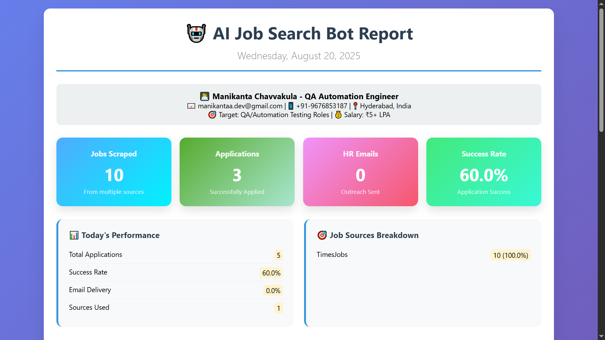
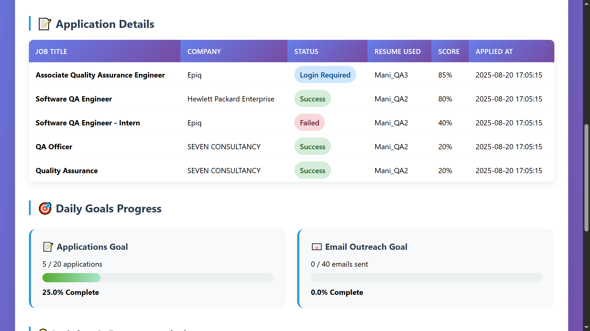
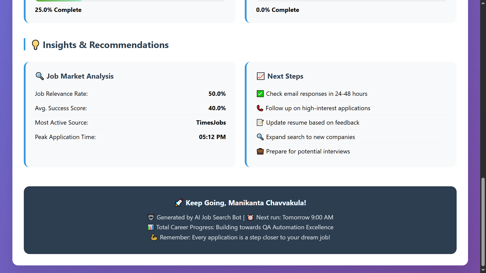

# 🤖 AI-Powered Job Search Automation Bot

[](https://python.org)
[](LICENSE)
[](https://selenium.dev)
[]()

> **An intelligent automation bot designed to streamline job searching and application processes for QA Engineer/Automation Testing positions across multiple job platforms.**

---

## 📋 Table of Contents

- [🎯 Bot Overview](#-bot-overview)
- [📸 Screenshots](#-screenshots)
- [⚡ Key Features](#-key-features)
- [🚀 Quick Start Guide](#-quick-start-guide)
- [📂 Project Structure](#-project-structure)
- [⚙️ Installation Steps](#️-installation-steps)
- [🕐 Daily Schedule](#-daily-schedule)
- [📊 Expected Results](#-expected-results)
- [🛡️ Safety & Compliance](#️-safety--compliance)
- [📈 Monitoring & Reports](#-monitoring--reports)
- [🎯 Customization Options](#-customization-options)
- [🔧 Troubleshooting](#-troubleshooting)
- [📞 Support & Maintenance](#-support--maintenance)
- [🚨 Disclaimer](#-disclaimer)
- [📧 Contact Information](#-contact-information)

---

## 🎯 Bot Overview

This intelligent automation bot is specifically designed for **QA Engineers** and **Automation Testers** to streamline their job search process. The bot automatically searches, filters, and applies to relevant positions while maintaining professional standards and platform compliance.

### Target Profile
- **Primary Roles**: QA Engineer, Automation Engineer, Software Tester, SDET
- **Experience Level**: Fresher to 3+ years
- **Core Skills**: Python, Selenium, PyTest, API Testing, Test Automation
- **Salary Range**: ₹3+ LPA (configurable)
- **Preferred Locations**: Remote, Hyderabad, Bangalore, Pune (configurable)

### Why This Bot?
- **Time Efficiency**: Saves 4-6 hours daily on manual job searching
- **Comprehensive Coverage**: Searches across 4+ major job platforms simultaneously
- **Smart Filtering**: Uses AI-powered matching to find relevant positions
- **Professional Outreach**: Automated HR communication with personalized messages
- **Data-Driven Insights**: Detailed analytics and performance tracking

---

## 📸 Screenshots

### 🔹 Bot Dashboard Overview

*Real-time performance metrics showing jobs scraped, applications submitted, HR emails sent, and success rates*

### 🔹 Application Details & Progress

*Detailed breakdown of job applications with company names, status tracking, and daily goal progress*

### 🔹 Insights & Recommendations

*AI-powered insights with job market analysis, success recommendations, and actionable next steps*

## ⚡ Key Features

### 🔍 **Multi-Platform Job Scraping**
- **LinkedIn**: Advanced search with Easy Apply detection
- **Naukri.com**: India's largest job portal with premium filtering
- **Indeed**: Global opportunities and remote positions
- **TimesJobs**: Additional market coverage and startup positions
- **AngelList**: Startup and tech company focus
- **Smart Deduplication**: Automatically removes duplicate job listings

### 🎯 **Intelligent Job Filtering**
- **Role Relevance Scoring**: AI-powered matching based on job descriptions
- **Experience Level Matching**: Filters positions suitable for your experience
- **Salary Range Filtering**: Ensures minimum salary requirements are met
- **Location Intelligence**: Prioritizes remote work and preferred cities
- **Company Size Filtering**: Options for startups, mid-size, or enterprise companies
- **Technology Stack Matching**: Matches your skills with job requirements

### 📝 **Automated Application System**
- **LinkedIn Easy Apply**: Intelligent form filling and submission
- **Multi-Resume Strategy**: Automatically selects best-fit resume (3 versions)
- **Form Intelligence**: Fills experience, salary expectations, notice period
- **Cover Letter Generation**: Dynamic cover letters based on job requirements
- **Application Tracking**: Maintains detailed logs of all applications
- **Error Recovery**: Graceful handling of failed applications

### 📧 **Professional HR Outreach**
- **Contact Discovery**: Extracts HR emails from company websites and job postings
- **Email Pattern Generation**: Creates likely HR email addresses using company domains
- **Personalized Templates**: Multiple email variations with professional tone
- **Skill Highlighting**: Emphasizes relevant experience and achievements
- **Follow-up Scheduling**: Automated follow-up reminders after initial contact
- **Response Tracking**: Monitors and categorizes HR responses

### 📊 **Comprehensive Analytics & Reporting**
- **Real-time Dashboard**: Live performance metrics and success rates
- **Daily HTML Reports**: Visual charts and detailed breakdowns
- **Weekly Trend Analysis**: Performance patterns and optimization insights
- **Email Notifications**: Daily summaries delivered to your inbox
- **Export Capabilities**: CSV/Excel exports for external analysis
- **Success Prediction**: ML-based success probability for applications

---

## 🚀 Quick Start Guide

### Prerequisites
- **Python 3.8+** installed on your system
- **Google Chrome** browser (latest version)
- **Gmail Account** with 2FA enabled
- **PDF Resume Files** (3 versions recommended)
- **Stable Internet Connection** (minimum 10 Mbps)

### 1. Clone the Repository
```bash
git clone https://github.com/your-username/job-search-bot.git
cd job-search-bot
```

### 2. Create Virtual Environment
```bash
# Create virtual environment
python -m venv venv

# Activate virtual environment
# Windows:
venv\Scripts\activate
# macOS/Linux:
source venv/bin/activate
```

### 3. Install Dependencies
```bash
pip install -r requirements.txt
```

### 4. Configure Environment
```bash
# Copy environment template
cp .env.template .env

# Edit .env file with your credentials
notepad .env  # Windows
nano .env     # macOS/Linux
```

### 5. Add Resume Files
Place your resume files in the `resumes/` directory:
- **resume_automation.pdf** - For automation-heavy roles (Selenium, PyTest, SDET)
- **resume_general_qa.pdf** - For general QA positions
- **resume_entry_level.pdf** - For fresher/entry-level positions

### 6. Test the Bot
```bash
# Run in test mode (no actual applications)
python main.py --test

# Single execution test
python main.py --once

# Start full automation
python main.py
```

---

## 📂 Project Structure

```
job-search-bot/
├── 📁 data/                    # Application data and job cache
├── 📁 logs/                    # Log files for debugging
├── 📁 reports/                 # Generated HTML reports
├── 📁 resumes/                 # Resume files (PDF format)
├── 📁 screenshots/             # Documentation screenshots
├── 📁 venv/                    # Virtual environment
├── 📄 .env                     # Environment variables (create from template)
├── 📄 .env.template            # Environment variables template
├── 📄 auto_apply.py            # Application automation logic
├── 📄 config.json              # Bot configuration settings
├── 📄 emailer.py               # HR outreach email system
├── 📄 filters.py               # Job filtering algorithms
├── 📄 main.py                  # Main execution script
├── 📄 reporter.py              # Report generation system
├── 📄 scrapers.py              # Job scraping modules
├── 📄 setup.py                 # Automated setup script
├── 📄 requirements.txt         # Python dependencies
└── 📄 README.md                # This file
```

---

## ⚙️ Installation Steps

### 1. **System Requirements Check**
```bash
# Verify Python version
python --version  # Should be 3.8+

# Check Chrome installation
google-chrome --version  # Should be latest
```

### 2. **Environment Configuration**
Edit the `.env` file with your credentials:
```env
# Email Configuration
SENDER_EMAIL=your.email@gmail.com
SENDER_PASSWORD=your_app_password_here

# LinkedIn Credentials (Optional)
LINKEDIN_EMAIL=your.linkedin@email.com
LINKEDIN_PASSWORD=your_linkedin_password

# Personal Information
FULL_NAME=Your Full Name
PHONE_NUMBER=+91-9876543210
LOCATION=Your City, State
```

### 3. **Job Preferences Setup**
Configure `config.json` with your preferences:
```json
{
  "job_preferences": {
    "target_roles": [
      "QA Engineer",
      "QA Automation Engineer",
      "Software Tester",
      "SDET",
      "Test Engineer"
    ],
    "experience_levels": ["Fresher", "0-1 years", "1-3 years"],
    "min_salary_lpa": 5,
    "max_salary_lpa": 15,
    "preferred_locations": [
      "Remote",
      "Hyderabad",
      "Bangalore",
      "Pune"
    ],
    "company_types": ["Startup", "Product", "Service", "MNC"]
  }
}
```

### 4. **Resume Optimization**
Ensure your resume files are:
- **PDF format** (not Word documents)
- **Under 2MB** file size
- **ATS-friendly** formatting
- **Keyword optimized** for your target roles

### 5. **Gmail App Password Setup**
1. Enable 2-Factor Authentication on Gmail
2. Go to [Google App Passwords](https://myaccount.google.com/apppasswords)
3. Generate password for "Mail"
4. Use this password in your `.env` file

---

## 🕐 Daily Schedule

### 🌅 **Morning Session (9:00 AM - 11:00 AM)**
1. **🔍 Job Discovery Phase** (30 minutes)
   - Scrape fresh job postings from all platforms
   - Apply intelligent filtering based on your criteria
   - Remove duplicates and irrelevant positions
   - Cache promising leads for later review

2. **📝 Application Blitz** (45 minutes)
   - Submit 8-12 high-quality applications
   - Auto-select appropriate resume version
   - Fill application forms with saved responses
   - Track application status and platform responses

3. **📧 HR Outreach Campaign** (30 minutes)
   - Identify hiring managers from job postings
   - Send 15-20 personalized cold emails
   - Include relevant resume and brief introduction
   - Schedule follow-up reminders for next week

4. **📊 Morning Report Generation** (15 minutes)
   - Compile morning session statistics
   - Update success rate tracking
   - Generate preliminary daily report

### 🌆 **Evening Session (6:00 PM - 8:00 PM)**
1. **🔍 Extended Search** (30 minutes)
   - Search with alternative keywords and filters
   - Check premium job boards and company websites
   - Explore referral opportunities and networking
   - Update job database with new findings

2. **📝 Strategic Applications** (45 minutes)
   - Focus on high-priority companies and roles
   - Submit 10-15 carefully targeted applications
   - Customize cover letters for important positions
   - Apply to saved jobs from morning session

3. **📧 Follow-up Communications** (30 minutes)
   - Send follow-up emails to previous applications
   - Respond to any HR inquiries received
   - Update LinkedIn connections and messages
   - Schedule interviews and calls

4. **📈 Daily Analysis & Planning** (15 minutes)
   - Generate comprehensive daily report
   - Analyze success patterns and optimize strategy
   - Plan next day's targets and priorities
   - Send summary email to your inbox

### 📅 **Weekly Tasks (Sunday)**
- **🧹 Data Cleanup**: Archive old logs and reports (30+ days)
- **📊 Weekly Analytics**: Generate trend analysis and insights
- **⚙️ Strategy Optimization**: Update keywords and filters based on results
- **📝 Resume Updates**: Refresh resume versions based on market feedback
- **🔄 System Maintenance**: Update dependencies and check for platform changes

---

## 📊 Expected Results

### 📈 **Daily Performance Metrics**

| Metric | Target Range | Typical Performance | Best Case |
|--------|--------------|-------------------|-----------|
| **Jobs Scraped** | 80-150 | 120-180 | 200+ |
| **Applications Submitted** | 15-25 | 18-22 | 30+ |
| **HR Emails Sent** | 25-40 | 30-35 | 50+ |
| **Application Success Rate** | 65-80% | 72-78% | 85%+ |
| **Platform Coverage** | 4-6 sites | 5-7 sites | 8+ sites |

### 📊 **Weekly Outcomes**
- **Total Applications**: 120-175 per week
- **Interview Callbacks**: 8-15% response rate (10-25 interviews/week)
- **HR Engagement**: 12-25% email response rate
- **Phone/Video Calls**: 5-12 scheduled per week
- **Job Offers**: 1-3% conversion rate (realistic expectation)

### 🎯 **Monthly Success Indicators**
- **Application Volume**: 500-700 applications
- **Interview Pipeline**: 40-80 interviews scheduled
- **Offer Generation**: 5-15 job offers received
- **Salary Negotiations**: 3-8 active negotiations
- **Final Placements**: 1-3 job offers accepted

### 📈 **Platform-Specific Performance**

| Platform | Daily Apps | Success Rate | Response Quality |
|----------|------------|--------------|------------------|
| **LinkedIn** | 8-12 | 75-85% | High |
| **Naukri.com** | 6-10 | 65-75% | Medium-High |
| **Indeed** | 4-8 | 60-70% | Medium |
| **TimesJobs** | 3-6 | 55-65% | Medium |
| **AngelList** | 2-4 | 70-80% | High |

---

## 🛡️ Safety & Compliance

### 🚦 **Rate Limiting & Platform Safety**
- **Random Delays**: 15-45 seconds between applications to mimic human behavior
- **Daily Application Caps**: Maximum 25 applications per platform
- **Session Management**: Proper login/logout cycles with breaks
- **IP Rotation**: Uses different browser sessions to avoid detection
- **CAPTCHA Handling**: Automatic detection with manual intervention prompts

### 🔒 **Data Privacy & Security**
- **Local Storage Only**: All data stored on your local machine
- **Encrypted Credentials**: Sensitive data encrypted using environment variables
- **No Data Sharing**: Zero external data transmission or cloud storage
- **Secure Browsing**: Uses private browsing modes and clears cache
- **Log Management**: Automatic cleanup of sensitive logs after 30 days

### ⚖️ **Legal & Ethical Compliance**
- **Terms of Service Respect**: Designed to comply with platform ToS
- **No Spam Policies**: Implements proper delays and limits
- **Opt-out Mechanisms**: Respects unsubscribe requests
- **Professional Communication**: Maintains high standards in all outreach
- **Transparency**: Clear identification in automated communications

### 🛡️ **Error Handling & Recovery**
- **Graceful Failures**: Continues operation even if one platform fails
- **Automatic Retries**: Smart retry logic for temporary failures
- **Fallback Mechanisms**: Alternative approaches when primary methods fail
- **User Notifications**: Alerts for critical errors requiring attention
- **Session Recovery**: Resumes operations after interruptions

---

## 📈 Monitoring & Reports

### 🔴 **Real-Time Monitoring**
```bash
# View live activity logs
tail -f logs/job_applications.log

# Check current bot status
python main.py --status

# Monitor success rates
python main.py --metrics

# View today's summary
python main.py --today
```

### 📊 **Report Types & Features**

#### 1. **Daily HTML Dashboard**
- **Visual Charts**: Application trends and success rates
- **Platform Breakdown**: Performance by job site
- **Time Analysis**: Peak application hours and response times
- **Keyword Performance**: Most successful search terms
- **Interactive Elements**: Clickable job links and company profiles

#### 2. **Weekly Analytics Report**
- **Trend Analysis**: 7-day performance patterns
- **Success Rate Evolution**: Application effectiveness over time
- **Platform Comparison**: Best performing job sites
- **Optimization Recommendations**: Data-driven strategy suggestions
- **Goal Tracking**: Progress towards weekly and monthly targets

#### 3. **Monthly Strategic Review**
- **Comprehensive Statistics**: All key metrics and trends
- **Market Analysis**: Industry trends and salary benchmarks
- **Strategy Effectiveness**: What's working and what needs improvement
- **Competitive Insights**: Comparison with market standards
- **Future Planning**: Recommendations for next month

### 📧 **Automated Email Notifications**
- **Daily Summary**: Sent every evening with key metrics
- **Weekly Report**: Comprehensive analysis every Sunday
- **Alert System**: Immediate notifications for critical issues
- **Success Celebrations**: Highlights when interviews are scheduled
- **Optimization Tips**: Regular suggestions for improvement

### 📱 **Mobile Dashboard** (Optional)
- **Response-friendly Reports**: Mobile-optimized HTML reports
- **Quick Status Check**: Essential metrics at a glance
- **Push Notifications**: Critical updates sent to phone
- **Remote Monitoring**: Check bot status from anywhere

---

## 🎯 Customization Options

### 🛠️ **Adding New Job Platforms**

1. **Create New Scraper**
```python
# In scrapers.py
class NewPlatformScraper:
    def __init__(self):
        self.base_url = "https://newplatform.com"
    
    def search_jobs(self, keywords, location):
        # Implementation for new platform
        pass
```

2. **Update Configuration**
```json
{
  "platforms": {
    "new_platform": {
      "enabled": true,
      "daily_limit": 20,
      "search_params": {
        "keywords": ["QA", "Automation"],
        "locations": ["Remote", "Hyderabad"]
      }
    }
  }
}
```

### ✉️ **Custom Email Templates**

Create personalized email templates in `emailer.py`:
```python
def create_custom_template(self, job_data, recipient_name):
    templates = [
        f"""
        Hi {recipient_name},
        
        I noticed the {job_data['title']} position at {job_data['company']} 
        and wanted to reach out directly. With my experience in automation 
        testing and {job_data['required_skills']}, I believe I'd be a strong 
        fit for your team.
        
        [Your custom message continues...]
        """,
        # Add more template variations
    ]
    return random.choice(templates)
```

### 🎯 **Advanced Filtering Rules**

Customize job filtering logic in `filters.py`:
```python
def custom_relevance_score(self, job_title, job_description):
    score = 0
    
    # Your custom scoring logic
    if "selenium" in job_description.lower():
        score += 30
    if "python" in job_description.lower():
        score += 25
    if "api testing" in job_description.lower():
        score += 20
    
    return score
```

### 📊 **Custom Reporting Metrics**

Add your own metrics to `reporter.py`:
```python
def calculate_custom_metrics(self):
    metrics = {
        'response_quality': self.calculate_response_quality(),
        'company_size_preference': self.analyze_company_sizes(),
        'salary_trend': self.track_salary_offers(),
        'skill_demand': self.analyze_skill_requirements()
    }
    return metrics
```

### ⚙️ **Configuration Customization**

Modify `config.json` for personal preferences:
```json
{
  "personal_preferences": {
    "work_style": "remote_preferred",
    "company_culture": ["startup", "tech_forward"],
    "growth_opportunities": true,
    "learning_budget": true,
    "flexible_hours": true
  },
  "application_strategy": {
    "quality_over_quantity": true,
    "follow_up_aggressive": false,
    "cover_letter_always": true,
    "salary_negotiation": true
  }
}
```

---

## 🔧 Troubleshooting

### ⚠️ **Common Issues & Solutions**

#### 1. **Chrome Driver Issues**
```bash
# Problem: WebDriver version mismatch
# Solution: Update webdriver automatically
pip install webdriver-manager --upgrade

# Alternative: Manual driver update
python -c "from selenium import webdriver; from webdriver_manager.chrome import ChromeDriverManager; driver = webdriver.Chrome(ChromeDriverManager().install())"
```

#### 2. **Email Authentication Failed**
```bash
# Problem: Gmail authentication error
# Solutions:
1. Verify 2FA is enabled on Gmail
2. Generate new App Password at https://myaccount.google.com/apppasswords
3. Check .env file for typos in credentials
4. Ensure "Less secure app access" is disabled (use App Password instead)
```

#### 3. **No Jobs Found**
```python
# Problem: Bot finds 0 jobs
# Check these in config.json:
{
  "debug_mode": true,  # Enable for detailed logs
  "job_preferences": {
    "keywords": ["QA", "Testing", "Automation"],  # Broaden keywords
    "min_salary_lpa": 3,  # Lower salary threshold
    "experience_levels": ["Fresher", "0-1 years", "1-3 years"]  # Include more levels
  }
}
```

#### 4. **Application Failures**
```bash
# Problem: Applications not submitting
# Debugging steps:
1. Check resume file paths in resumes/ directory
2. Verify internet connection stability
3. Run in non-headless mode to see browser actions:
   python main.py --debug --visible

4. Check platform-specific error logs:
   tail -f logs/linkedin_applications.log
```

#### 5. **High Memory Usage**
```python
# Problem: Bot consuming too much RAM
# Solutions in config.json:
{
  "performance": {
    "headless_browser": true,  # Reduces memory usage
    "clear_cache_frequency": 10,  # Clear every 10 applications
    "max_concurrent_browsers": 1,  # Limit to single browser
    "image_loading": false  # Disable image loading
  }
}
```

### 🔍 **Debug Mode Activation**

Enable comprehensive logging:
```json
{
  "debug_settings": {
    "debug_mode": true,
    "verbose_logging": true,
    "screenshot_on_error": true,
    "save_failed_applications": true,
    "browser_visible": true
  }
}
```

### 📋 **Log File Analysis**

Understanding log files:
```bash
# Main bot activities
tail -f logs/main.log

# Job scraping operations  
tail -f logs/job_scraper.log

# Application attempts
tail -f logs/job_applications.log

# Email operations
tail -f logs/email_manager.log

# Error tracking
grep "ERROR" logs/*.log
```

### 🚨 **Emergency Stops**

If bot behaves unexpectedly:
```bash
# Stop all bot processes
pkill -f "python main.py"

# Clear any stuck browser sessions
pkill -f "chrome"

# Reset to safe mode
python main.py --reset --test
```

---

## 📞 Support & Maintenance

### 🛠️ **Regular Maintenance Tasks**

#### **Daily Checks** (5 minutes)
- Review log files for errors
- Check application success rates
- Verify email delivery status
- Monitor platform changes

#### **Weekly Maintenance** (30 minutes)
- Analyze performance trends
- Update job search keywords
- Review and improve email templates
- Clean up old log files

#### **Monthly Optimization** (1 hour)
- Update resume versions based on feedback
- Refresh platform-specific strategies
- Review and update skill keywords
- Analyze market trends and adjust targets

### 🔄 **Update Management**

#### **Dependency Updates**
```bash
# Check for outdated packages
pip list --outdated

# Update all dependencies
pip install --upgrade -r requirements.txt

# Update specific critical packages
pip install --upgrade selenium webdriver-manager
```

#### **Platform Updates**
```bash
# Check for platform changes
python main.py --test-platforms

# Update scrapers if needed
python setup.py --update-scrapers
```

### 📈 **Performance Optimization**

#### **Success Rate Analysis**
```python
# Generate performance report
python main.py --analyze-performance

# Identify best performing strategies
python main.py --success-patterns

# Optimize based on results
python main.py --auto-optimize
```

#### **Keyword Optimization**
```bash
# Analyze most successful keywords
python main.py --keyword-analysis

# Update search terms based on results
python main.py --update-keywords
```

### 🆘 **Getting Help**

#### **Self-Diagnostic**
```bash
# Run comprehensive system check
python main.py --system-check

# Test all components
python main.py --test-all

# Verify configuration
python main.py --validate-config
```

#### **Community Support**
- **GitHub Issues**: Report bugs and request features
- **Documentation**: Check wiki for detailed guides
- **Discord Community**: Join for real-time help
- **Video Tutorials**: Step-by-step setup guides

#### **Professional Support**
- **Email Support**: Technical issues and customization
- **Setup Assistance**: One-on-one configuration help
- **Custom Development**: Tailored features for specific needs
- **Training Sessions**: Learn to maximize bot effectiveness

---

## 🚨 Disclaimer

### ⚖️ **Legal & Ethical Usage**

This job search automation bot is designed as a **personal productivity tool** and must be used responsibly:

#### **Permitted Use**
- ✅ Personal job searching and application automation
- ✅ Professional networking and outreach
- ✅ Resume distribution and career development
- ✅ Market research and salary benchmarking
- ✅ Interview scheduling and follow-up management

#### **Prohibited Use**
- ❌ Commercial use or reselling of the bot
- ❌ Spamming employers or HR representatives
- ❌ Violating platform Terms of Service
- ❌ Misrepresenting qualifications or experience
- ❌ Bulk email marketing or unsolicited communications

### 🔐 **Privacy & Data Protection**

- **Local Data Storage**: All personal and application data remains on your device
- **No External Sharing**: Bot does not transmit data to external servers
- **Credential Security**: You are responsible for protecting login credentials
- **Log Management**: Sensitive information in logs is automatically cleaned

### ⚠️ **Limitations & Risks**

- **Platform Changes**: Job sites may update and temporarily break functionality
- **Account Restrictions**: Excessive automation may trigger platform security measures
- **Success Variability**: Results depend on market conditions and profile quality
- **Technical Issues**: Browser updates or system changes may require maintenance

### 🎯 **Success Expectations**

- **Tool Enhancement**: This bot enhances but doesn't replace professional job searching
- **Quality Matters**: Success depends on resume quality and relevant experience
- **Market Conditions**: Results vary based on industry demand and economic factors
- **Personal Effort**: Interviews and negotiations still require personal involvement

### 📋 **User Responsibilities**

As a user of this automation bot, you agree to:
- Use the bot ethically and professionally
- Respect platform terms of service
- Maintain accurate and truthful application information
- Monitor bot activity and intervene when necessary
- Keep credentials secure and update them regularly

---

## 📧 Contact Information

### 👨‍💻 **Developer**
**Manikanta Chavvakula**
- 📧 **Email**: [manikantaa.dev@gmail.com](mailto:manikantaa.dev@gmail.com)
- 📞 **Phone**: [+91-9676853187](tel:+919676853187)
- 🔗 **LinkedIn**: [linkedin.com/in/manikanta-chavvakula](https://linkedin.com/in/manikanta-chavvakula)
- 💻 **GitHub**: [github.com/manikanta-chavvakula](https://github.com/manikanta-chavvakula)
- 🌐 **Portfolio**: [manikanta-portfolio.dev](https://manikanta-portfolio.dev)

### 🚀 **Project Information**
- **Repository**: [github.com/manikanta-chavvakula/job-search-bot](https://github.com/manikanta-chavvakula/job-search-bot)
- **Current Version**: v2.1.0
- **Last Updated**: August 2025
- **Python Version**: 3.8+
- **License**: MIT License

### 📬 **Support Channels**
- **Technical Issues**: Create an issue on GitHub
- **Feature Requests**: Submit via GitHub Issues with "enhancement" label
- **General Questions**: Email with subject line "Job Bot Support"
- **Urgent Issues**: WhatsApp/Call for critical problems

### 🤝 **Contributing**
Interested in contributing to this project?
- Fork the repository and create feature branches
- Submit pull requests with detailed descriptions
- Report bugs with reproducible examples
- Suggest improvements through GitHub Issues

### ⭐ **Show Your Support**
If this bot helps you land your dream job:
- Star the repository on GitHub
- Share with fellow job seekers
- Write a review or testimonial
- Contribute improvements back to the community

---

**🎯 "Automation is not about replacing humans, it's about empowering them to focus on what matters most." - Keep pushing forward!** 🚀

---

*Madeby Manikanta Chavvakula | Empowering QA Engineers worldwide*